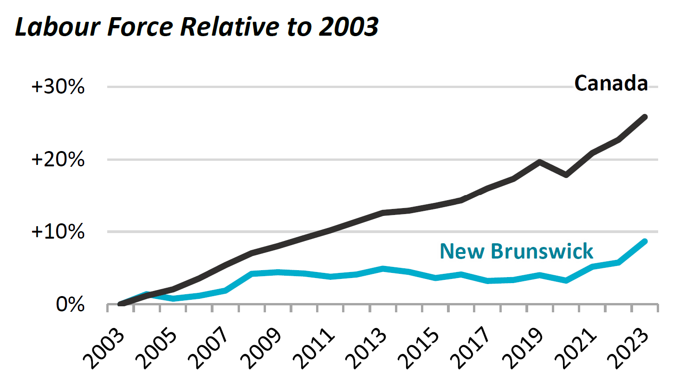
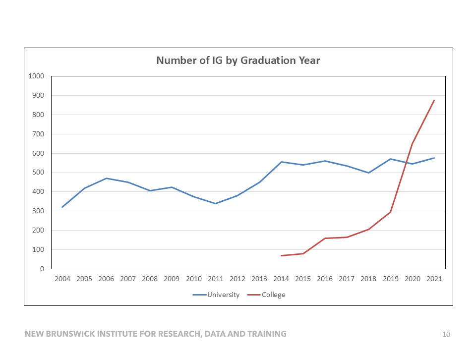
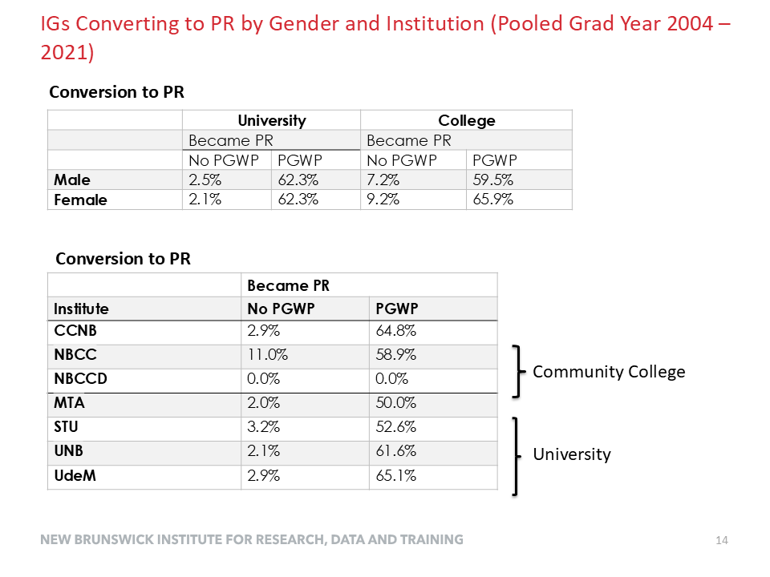
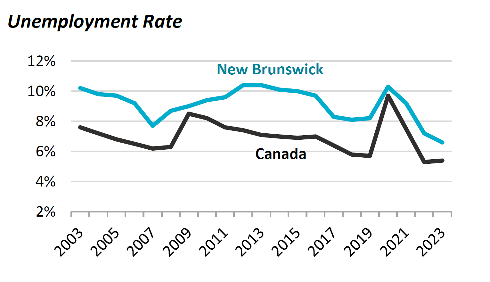

# The paper

---

Not.

# The presentation

- migration into New Brunswick

## Why?

# The presentation

- A lot of facts
- A lot of acronyms...

# What did I retain?

- colleges
- origins
- provincial nominees

## Some conceptual questions

## Reverse migration
- no discussion of reverse migration (PR from elsewhere coming to NB)
- if none, why? General competitiveness of the NB labor market.

## Provincial nominees

- nearly half of university graduates who become PR
- regressions don't show quite as much effects
- what drives that process?

## Community colleges

 

## Community colleges

- not much difference in "conversion" rates

## Community colleges

- not just for PR - do they stay? 60% (> 50% university graduates)
- what are the skills conveyed by community colleges that are in demand?

## "Default" retention rates

- What is the "emigration" rate for natives? 
- What is the "return immigration rate" for natives?

# Suggestions

## Location effects

- NB is small, but not uniform (UR, other)
- Overall economic climate

## Other correlates of retention

- marital status: easier to move if single student then married with differential employment status

## Role of community colleges

- strong growth
- also political issues surrounding cutting back on admitting short-term students may put this at risk

## Role of temporary workers

- strong conversion
- what drives changes over time (event study)

## Source region differences

## Policy questions

## How to create stickiness? 

- choice of immigrants (married vs. students)?
- housing subsidies?
- family ties?

## How to create a general "pull" effect?

What attracts anybody will also attract immigrants, but how to create differential attractiveness? Why?

## How to create specific "pull" effects?

- clusters? 🇷🇴 🇬🇧

## One possible solution

## Your competition's solution

[^nyt]

[^nyt]: Source: [New York Times](https://messaging-custom-newsletters.nytimes.com/dynamic/render?campaign_id=50&emc=edit_cnda_20240928&instance_id=135540&isViewInBrowser=true&nl=canada-letter&regi_id=71839939&segment_id=179077&te=1&uri=nyt://newsletter/06badc0b-fdd1-5202-9b85-2de5bb44d5ff&user_id=99ba9e49e8e79c5fdde54b93259c0d75)

## Targeted recruiting

- Recruit in specific countries
- Acknowledges the apparent benefits of enclave effects

## Footnotes
